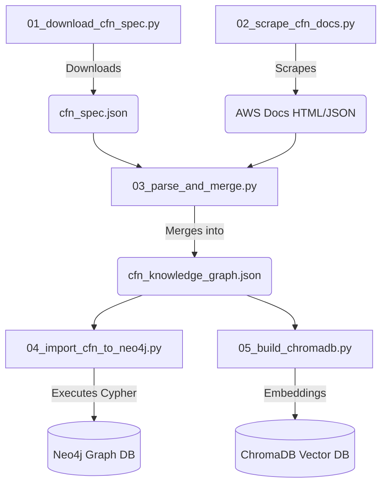
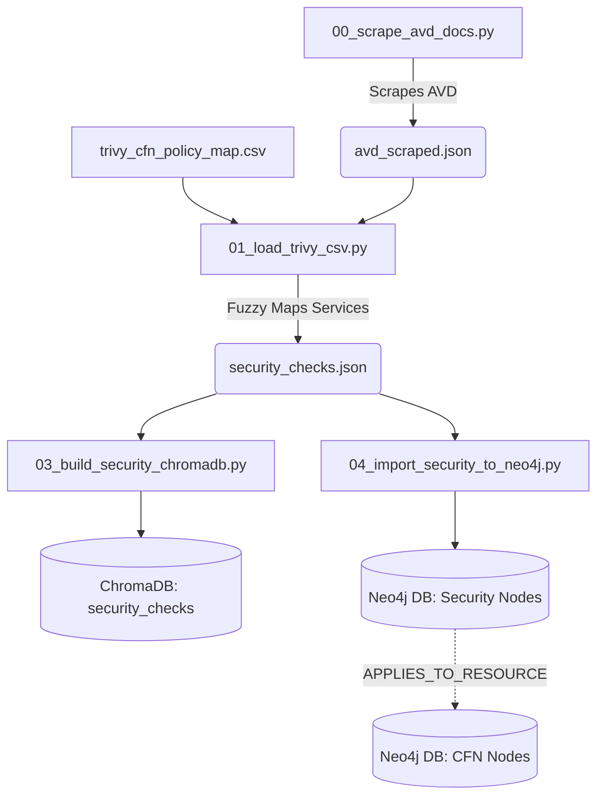

# Infrastructure-as-Code (IaC) Hybrid GraphRAG

This directory contains the ingestion and execution scripts for the **Dual-Stream Hybrid GraphRAG** system. It provides Large Language Models (LLMs) with high-fidelity, hallucination-free context for automatically remediating CloudFormation (CFN) templates.

Our RAG system is split into two deeply interconnected streams:
1. **CFN Structural RAG:** Handles syntax, required properties, and resource structure.
2. **Security Policy RAG:** Handles Trivy/Checkov vulnerability rules, impacts, and secure code examples.

## Architecture

We use **ChromaDB** for probabilistic semantic search (e.g., *"How do I configure an S3 bucket?"*) and **Neo4j** for deterministic, structured knowledge traversal (e.g., *"What exact properties belong to AWS::S3::Bucket?"*).

Crucially, the Security Graph and the CFN Graph are joined in Neo4j via an explicit `APPLIES_TO_RESOURCE` edge. This means if a security vulnerability is flagged, the system can instantly pull both the security remediation instructions AND the structural CFN schema required to implement the fix.

### Flowchart: CFN Data Pipeline


### Flowchart: Security Data Pipeline



## Setup & Ingestion Instructions

Before running the ingestion pipelines, ensure your local Docker containers for Neo4j and ChromaDB are running:

```bash
docker-compose up -d

```

### Step 1: Ingest CloudFormation Schema (Structural RAG)

Run the scripts in sequential order to scrape, merge, and import the CFN resource specifications.

```bash
python scripts/graphrag/01_download_cfn_spec.py
python scripts/graphrag/02_scrape_cfn_docs.py
python scripts/graphrag/03_parse_and_merge.py
python scripts/graphrag/04_import_cfn_to_neo4j.py
python scripts/graphrag/05_build_chromadb.py

```

### Step 2: Ingest Security Rules (Security RAG)

Once the CFN base graph exists, navigate to the security directory to ingest Trivy/AVD policies and forge the cross-graph relationships.

```bash
cd scripts/graphrag/security/
python 00_scrape_avd_docs.py
python 01_load_trivy_csv.py
python 03_build_security_chromadb.py
python 04_import_security_to_neo4j.py

```

## Testing Retrieval

To verify that the databases are populated and retrieving correctly, you can run the local test scripts:

**Test CFN Structural RAG:**

```bash
python scripts/graphrag/06_execute_g_retrieval.py

```

**Test Security Policy RAG:**

```bash
python scripts/graphrag/security/05_execute_security_g_retrieval.py

```

## Embedding Providers

The ingestion scripts natively support both `HuggingFace` and `Ollama`.
You can configure this via your `.env` file:

```env
EMBEDDING_PROVIDER=ollama
EMBEDDING_MODEL=mxbai-embed-large

```

*Note: The scripts automatically enforce L2-normalization for local models to ensure consistent `cosine` distance thresholds in ChromaDB.*